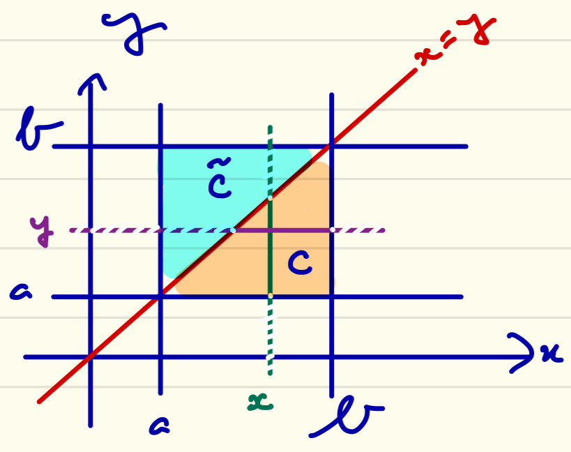

---
header-includes:
  - \usepackage{mathrsfs}
---

## MAM3
# Mathématiques de l'ingénieur.e 1
# 2023-24

# Exam CC no. 2

**Durée 2H. Documents non autorisés. Rendre sur deux copies séparées les exos 1 et 2 d'une part, 3 et 4 d'autre part.**

## Exercice 1 (6 points)
Pour chacune des expressions ci-dessous (où $n \geq 1$) dire si la limite quand $n \to \infty$ existe et, le cas échéant, déterminer cette limite.

### 1.1
$$ \int_1^\infty x^n e^{-x}\ \mathrm{d}x $$

**Réponse.** En posant $f_n(x) := x^n e^{-x}$, on définit une suite croissante (remarquer que $x \geq 1$, donc que $x^n \leq x^{n+1}$) de fonctions positives : le théorème de convergence monotone s'applique. Clairement, pour $x > 1$, on a $f_n(x) \to \infty$ quand $n \to \infty$, de sorte que la limite de la suite d'intégrales existe et vaut $\infty$.

### 1.2
$$ \int_0^n \frac{1-\cos(x/n)}{1+x^4}\ \mathrm{d}x $$

**Réponse.** En posant

$$ f_n(x) := \frac{1-\cos(x/n)}{1+x^4} \chi_{[0,n]}(x) $$

on définit une suite de fonctions intégrables sur $\mathbf{R}_+$ qui converge simplement vers $0$ et sont toutes dominées par la fonction intégrable $2/(1+x^4)$. D'où l'existence de la limite, nulle, par convergence dominée.

### 1.3
$$ \int_0^n (1-x/n)^{n^2}\cos(nx)\ \mathrm{d}x $$

**Réponse.** En posant $f_n(x) := (1-x/n)^{n^2}\cos(nx)\chi_{[0,n]}(x)$, on définit une suite de fonctions intégrables sur $\mathbf{R}+$ qui converge simplement vers $0$ en tout $x > 0$ puisque  $(1-x/n)^{n^2} = e^{n^2\ln(1-x/n)}$ qui tend (équivalent puis composition de limites) vers $\lim_{y \to \infty} e^{-y}=0$. D'où l'existence de la limite, nulle, par convergence dominée puisque, pour tout réel $x$ on a $1-x \leq e^{-x}$ (convexité), de sorte que $0 \leq (1-x/n)^n \leq e^{-x}$ si $x \in [0,n]$ et

$$ |(1-x/n)^{n^2}\cos(nx)\chi_{[0,n]}(x)| \leq e^{-nx} \leq e^{-x},\quad x \geq 0,\quad n \geq 1. $$

## Exercice 2 (5 points)

### 2.1
Montrer que la fonction

$$ F(t) := \int_\mathbf{R} e^{-|x|}\cos(tx)\ \mathrm{d}x $$

est bien définie pour tout réel $t$.

**Réponse.** Pour $t$ un réel fixé, la valeur absolue de l'intégrande est une fonction paire dominée en valeur absolue sur $\mathbf{R}_+$ par $e^{-x}$, intégrable. D'où l'intégrabilité.

### 2.2
Soit $t_0 \in \mathbf{R}$, montrer que $F$ est continue en $t_0$.

**Réponse.** La majoration précédente, uniforme en $t$ (et valable sur tout $\mathbf{R}$, voisinage de $t_0$ !), associée à la continuité en $t$ de l'intégrande, montre la continuité en $t_0$ de l'intégrale paramétrée.

### 2.3
Calculer $F(t)$ pour tout $t \in \mathbf{R}$.

**Réponse.** Par parité, on se ramène à calculer

$$ \begin{eqnarray*}
  2\text{Re}( \int_0^\infty e^{-x+itx}\ \mathrm{d}x )
  &=& 2\text{Re} \left[ \frac{e^{(it-1)x}}{it-1} \right]_0^\infty
  &=& \frac{2}{1+t^2} \cdot
\end{eqnarray*} $$

### 2.4
Déduire de ce qui précède la valeur de

$$ \int_\mathbf{R} xe^{-|x|}\sin(x)\ \mathrm{d}x $$

**Réponse.** La dérivée partielle de l'intégrande existe et vaut $-xe^{-|x|}\sin(tx)$, fonction paire dont la valeur absolue est dominée  sur $\mathbf{R}_+$ par $xe^{-x}$, intégrable (cette majoration est à nouveau valable sur $\mathbf{R}$, voisinage de $t_0$). On confirme ainsi la dérivabilité de l'intégrale paramétrée en $t_0$, et 

$$ F'(t_0) =-\int_\mathbf{R} xe^{-|x|}\sin(t_0 x)\ \mathrm{d}x. $$

En particulier, en faisant $t_0=1$ et en utilisant la question  précédente,

$$ \int_\mathbf{R} xe^{-|x|}\sin(x)\ \mathrm{d}x = -F'(1)
= - \left( \frac{2}{1+t^2} \right)'_{|t=1} = 1. $$

## Exercice 3 (5 points)

### 3.1
Soit $g \in L^1(\mathbf{R})$. Montrer que

$$ f(x) := \int_{-\infty}^x g(y)\ \mathrm{d}y,\quad x \in \mathbf{R} $$

est bien définie.

**Réponse.** Puisque $g$ est intégrable sur $\mathbf{R}$, elle l'est *a fortiori* sur tout intervalle $]-\infty,x] \subset \mathbf{R}$.

### 3.2
Déterminer, si elle existe, la limite de la suite $(f(-n))_n$ quand $n \to \infty$.

**Réponse.** En posant $g_n(x) := g(x)\chi_{]-\infty,-n]}$, on définit une suite de fonctions intégrables sur $\mathbf{R}$ qui converge simplement vers $0$ et dont la valeur absolue est dominée par celle de $g$, intégrable. On en déduit par convergence dominée que la limite existe et vaut $0$.

### 3.3
Déterminer, si elle existe, la limite de la suite $(f(n))_n$ quand $n \to \infty$.

**Réponse.** En posant $h_n(x) := g(x)\chi_{]-\infty,n]}$, on définit une suite de fonctions intégrables sur $\mathbf{R}$ qui converge simplement vers $g$ et dont la valeur absolue est dominée par celle de $g$, intégrable. On en déduit par convergence dominée que la limite existe et vaut $\int_{\mathbf{R}} g(x)\ \mathrm{d}x$.

### 3.4
Si on suppose de plus que $f \in L^1(\mathbf{R})$, montrer que $f(n) \to 0$ quand $n \to \infty$.

**Réponse.**  Comme à la question précédente, on vérifie par convergence dominée que  pour toute suite $(x_n)_n \to \infty$, on a

$$ f(x_n) \to \int_{\mathbf{R}} g(x)\ \mathrm{d}x =: \ell, $$

c'est-à-dire $\lim_{x \to \infty} f(x) = \ell$.  Supposons par l'absurde $\ell \neq 0$ ; il existe en particulier $A$ tel que, pour tout $x \geq A$, $|f(x)| \geq |\ell|/2 > 0$. Mais alors

$$ \int_\mathbf{R} |f(x)|\ \mathrm{d}x \geq \int_A^\infty |f(x)|\ \mathrm{d}x \geq \infty \times |\ell|/2 = \infty, $$

ce qui contredit le caractère intégrable de $f$.

## Exercice 4 (4 points)
Soient $a$ et $b$ deux réels, $a < b$. Soit $f \in L^1([a,b]^2)$.

### 4.1
Montrer que les deux intégrales ci-dessous sont bien définies et égales : 

$$ \int_a^b \left( \int_a^x f(x,y)\ \mathrm{d}y \right)\ \mathrm{d}x
 = \int_a^b \left( \int_y^b f(x,y)\ \mathrm{d}x \right)\ \mathrm{d}y =: I. $$

**Réponse.**  L'égalité résulte de l'application du théorème de Fubini au calcul de l'intégrale de $f$ sur

$$ C := \lbrace (x,y) \in [a,b]^2\ |\ x \geq y \rbrace. $$

### 4.2
On suppose de plus que, presque pour tout $(x,y) \in [a,b]^2$, on a $f(y,x)=f(x,y)$. Montrer que

$$ I = \frac{1}{2} \int_{[a,b]^2} f(x,y)\ \mathrm{d}x\mathrm{d}y. $$

**Réponse.** Soit

$$ \widetilde{C} := \lbrace (x,y) \in [a,b]^2\ |\ y \geq x \rbrace $$

le symétrique de $C$ par rapport à la droite $y=x$. On a

$$ \int_{[a,b]^2} f(x,y)\ \mathrm{d}x\mathrm{d}y = \int_C f(x,y)\ \mathrm{d}x\mathrm{d}y + \int_{\widetilde{C}} f(x,y)\ \mathrm{d}x\mathrm{d}y, $$

et

$$ \int_{\widetilde{C}} f(x,y)\ \mathrm{d}x\mathrm{d}y = \int_C f(v,u)\ \mathrm{d}u\mathrm{d}v, $$

cette dernière égalité (claire géométriquement) s'obtenant en considérant le changement de variable $(x,y) = (v,u) = \varphi(u,v)$, $\varphi : C \to \widetilde{C}$ (noter que $|\det\varphi'(u,v)| = 1$). On en déduit l'égalité voulue quand $f$ est symétrique.
